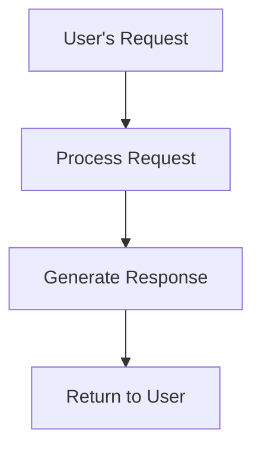

# Content Validation Rules

**Purpose:** Prevent file creation errors through pre-validation

**CRITICAL:** All content MUST be validated before writing to files.

---

## Mermaid Diagram Validation

### Required Validation Steps

**BEFORE creating any file with Mermaid diagrams:**

1. **Syntax Check**
   - Validate Mermaid syntax is correct
   - Check flowchart/sequence/class diagram syntax
   - Verify all node connections are valid

2. **Character Escaping**
   - Escape double quotes: `"` → `\"`
   - Escape single quotes: `'` → `\'`
   - Escape special characters in labels

3. **Node ID Validation**
   - Use alphanumeric characters only
   - Use underscores for spaces: `user_login` not `user login`
   - Avoid special characters in node IDs

4. **Connection Validation**
   - Ensure all referenced nodes exist
   - Verify arrow syntax is correct
   - Check for circular references

### Fallback Strategy

**ALWAYS provide text alternative:**

```markdown
## Workflow Visualization

### Mermaid Diagram
```mermaid
[validated diagram content]
```

### Text Alternative
```
Phase 1: INCEPTION
- Stage 1: Workspace Detection (COMPLETED)
- Stage 2: Requirements Analysis (IN PROGRESS)
- Stage 3: Workflow Planning (PENDING)

Phase 2: CONSTRUCTION
- Stage 4: Code Generation (PENDING)
- Stage 5: Build and Test (PENDING)
```
```

**If Mermaid validation fails:** Use text alternative only, do not write invalid Mermaid.

---

## General Content Validation

### Pre-Creation Validation Checklist

Before writing ANY file, validate:

- [ ] **Embedded code blocks** - Check JSON, YAML, Mermaid syntax
- [ ] **Special characters** - Ensure proper escaping in markdown
- [ ] **Markdown syntax** - Verify headers, lists, links are correct
- [ ] **File paths** - Ensure referenced paths exist or will be created
- [ ] **Content parsing** - Test that content can be parsed correctly

### Common Issues to Check

**Markdown Issues:**
- Unclosed code blocks (missing ```)
- Incorrect header levels (### followed by #)
- Broken links or references
- Unescaped special characters in text

**Code Block Issues:**
- Invalid JSON (missing commas, quotes)
- Invalid YAML (incorrect indentation)
- Invalid Mermaid (syntax errors)
- Unclosed code blocks

**Path Issues:**
- References to non-existent files
- Incorrect relative paths
- Missing directory structure

---

## Validation Process

### Step 1: Identify Content Type
- Plain markdown text
- Mermaid diagram
- JSON configuration
- YAML configuration
- Code examples

### Step 2: Apply Appropriate Validation
- Use syntax checker for code blocks
- Validate Mermaid with simple test
- Check JSON/YAML parsing
- Verify markdown structure

### Step 3: Prepare Fallback
- For Mermaid: Create text alternative
- For complex content: Simplify if needed
- For code: Ensure syntax is valid

### Step 4: Write File
- Only write if validation passes
- Include fallback content where appropriate
- Log any validation issues

---

## Example: Mermaid Validation

### ❌ Invalid Mermaid (DO NOT WRITE)

```mermaid
graph TD
    A[User's Request] --> B[Process Request]
    B --> C[Generate "Response"]
    C --> D[Return to User]
```

**Issue:** Unescaped quotes in node label

### ✅ Valid Mermaid (SAFE TO WRITE)



**Or with escaped quotes:**

```mermaid
graph TD
    A[User's Request] --> B[Process Request]
    B --> C[Generate \"Response\"]
    C --> D[Return to User]
```

---

## Rationale

**Why validate before writing?**
- Prevents file creation errors
- Avoids corrupted artifacts
- Ensures all content is parseable
- Maintains workflow integrity
- Reduces debugging time

**Why provide fallbacks?**
- Ensures information is never lost
- Provides alternative representation
- Maintains workflow progress
- Improves accessibility

---

**Keep this file loaded:** Content validation applies throughout entire workflow.
