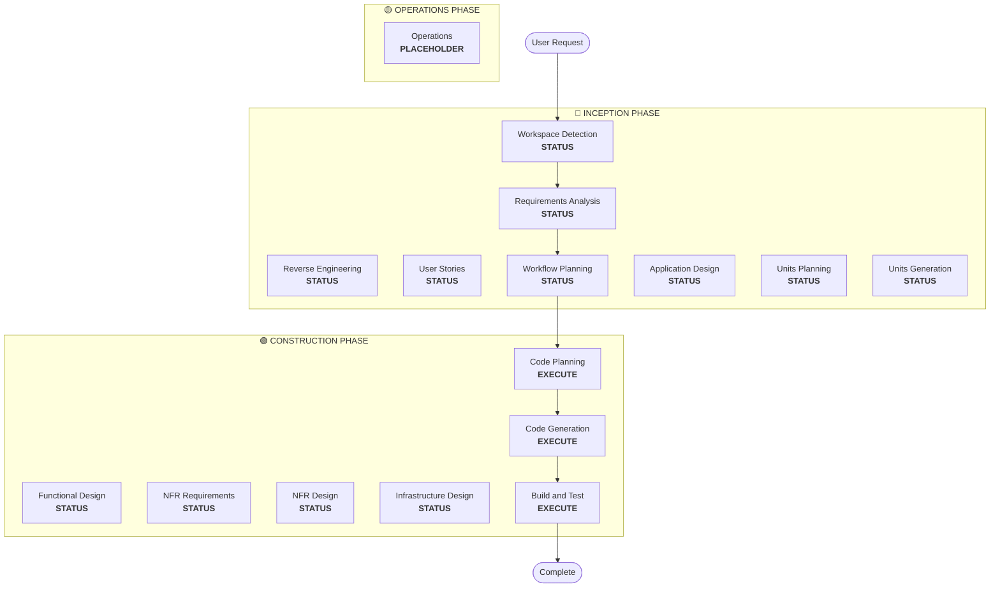

## WORKSPACE_DETECTION

Purpose: determine workspace state, check for existing AI-DLC projects.

### Steps

1. Check for Existing AI-DLC Project
   - `aidlc-docs/aidlc-state.md` exists → resume from last phase (load context)
   - not exists → new project assessment

2. Scan Workspace for Existing Code
   - Scan for source files (.java, .py, .js, .ts, .jsx, .tsx, .kt, .kts, .scala, .groovy, .go, .rs, .rb, .php, .c, .h, .cpp, .hpp, .cc, .cs, .fs, etc.)
   - Check for build files (pom.xml, package.json, build.gradle, etc.)
   - Identify project structure indicators
   - Identify workspace root directory (NOT aidlc-docs/)

   Record:
   ```markdown
   ## Workspace State
   - **Existing Code**: [Yes/No]
   - **Programming Languages**: [List if found]
   - **Build System**: [Maven/Gradle/npm/etc. if found]
   - **Project Structure**: [Monolith/Microservices/Library/Empty]
   - **Workspace Root**: [Absolute path]
   ```

3. Determine Next Phase
   - empty workspace → `brownfield = false` → Requirements Analysis
   - existing code → `brownfield = true` → check `aidlc-docs/inception/reverse-engineering/`
     - reverse engineering artifacts exist → load, skip to Requirements Analysis
     - no artifacts → Reverse Engineering

4. Create Initial State File

   Create `aidlc-docs/aidlc-state.md`:

   ```markdown
   # AI-DLC State Tracking

   ## Project Information
   - **Project Type**: [Greenfield/Brownfield]
   - **Start Date**: [ISO timestamp]
   - **Current Stage**: INCEPTION - Workspace Detection

   ## Workspace State
   - **Existing Code**: [Yes/No]
   - **Reverse Engineering Needed**: [Yes/No]
   - **Workspace Root**: [Absolute path]

   ## Code Location Rules
   - **Application Code**: Workspace root (NEVER in aidlc-docs/)
   - **Documentation**: aidlc-docs/ only
   - **Structure patterns**: See code-generation.md Critical Rules

   ## Stage Progress
   [Will be populated as workflow progresses]
   ```

5. Present Completion Message

   Brownfield:
   ```markdown
   # 🔍 Workspace Detection Complete

   Workspace analysis findings:
   • **Project Type**: Brownfield project
   • [AI-generated summary of workspace findings in bullet points]
   • **Next Step**: Proceeding to **Reverse Engineering** to analyze existing codebase...
   ```

   Greenfield:
   ```markdown
   # 🔍 Workspace Detection Complete

   Workspace analysis findings:
   • **Project Type**: Greenfield project
   • **Next Step**: Proceeding to **Requirements Analysis**...
   ```

6. Automatically Proceed
   - No user approval required (informational only)
   - Brownfield → Reverse Engineering (if no artifacts) | Requirements Analysis (if artifacts exist)
   - Greenfield → Requirements Analysis

## REVERSE_ENGINEERING

Purpose: analyze existing codebase, generate comprehensive design artifacts.

Execute when: brownfield project detected.
Skip when: greenfield project.
Rerun behavior: always rerun when brownfield detected (even if artifacts exist) to reflect current code state.

### Step 1: Multi-Package Discovery

1.1 Scan Workspace: all packages, relationships via config files, types (Application, CDK/Infrastructure, Models, Clients, Tests)

1.2 Understand Business Context: core business, business overview per package, business transactions

1.3 Infrastructure Discovery: CDK packages, Terraform (.tf), CloudFormation (.yaml/.json), deployment scripts

1.4 Build System Discovery: build systems (Brazil, Maven, Gradle, npm), config files, build dependencies

1.5 Service Architecture Discovery: Lambda functions, container services, API definitions (Smithy, OpenAPI), data stores

1.6 Code Quality Analysis: languages/frameworks, test coverage, linting, CI/CD pipelines

### Step 2: Generate Business Overview

Create `aidlc-docs/inception/reverse-engineering/business-overview.md`:

```markdown
# Business Overview

## Business Context Diagram
[Mermaid diagram showing the Business Context]

## Business Description
- **Business Description**: [Overall Business description of what the system does]
- **Business Transactions**: [List of Business Transactions that the system implements and their descriptions]
- **Business Dictionary**: [Business dictionary terms that the system follows and their meaning]

## Component Level Business Descriptions
### [Package/Component Name]
- **Purpose**: [What it does from the business perspective]
- **Responsibilities**: [Key responsibilities]
```

### Step 3: Generate Architecture Documentation

Create `aidlc-docs/inception/reverse-engineering/architecture.md`:

```markdown
# System Architecture

## System Overview
[High-level description of the system]

## Architecture Diagram
[Mermaid diagram showing all packages, services, data stores, relationships]

## Component Descriptions
### [Package/Component Name]
- **Purpose**: [What it does]
- **Responsibilities**: [Key responsibilities]
- **Dependencies**: [What it depends on]
- **Type**: [Application/Infrastructure/Model/Client/Test]

## Data Flow
[Mermaid sequence diagram of key workflows]

## Integration Points
- **External APIs**: [List with purposes]
- **Databases**: [List with purposes]
- **Third-party Services**: [List with purposes]

## Infrastructure Components
- **CDK Stacks**: [List with purposes]
- **Deployment Model**: [Description]
- **Networking**: [VPC, subnets, security groups]
```

### Step 4: Generate Code Structure

Create `aidlc-docs/inception/reverse-engineering/code-structure.md`:

```markdown
# Code Structure

## Build System
- **Type**: [Maven/Gradle/npm/Brazil]
- **Configuration**: [Key build files and settings]

## Key Classes/Modules
[Mermaid class diagram or module hierarchy]

### Existing Files Inventory
[List all source files with their purposes - these are candidates for modification in brownfield projects]

**Example format**:
- `[path/to/file]` - [Purpose/responsibility]

## Design Patterns
### [Pattern Name]
- **Location**: [Where used]
- **Purpose**: [Why used]
- **Implementation**: [How implemented]

## Critical Dependencies
### [Dependency Name]
- **Version**: [Version number]
- **Usage**: [How and where used]
- **Purpose**: [Why needed]
```

### Step 5: Generate API Documentation

Create `aidlc-docs/inception/reverse-engineering/api-documentation.md`:

```markdown
# API Documentation

## REST APIs
### [Endpoint Name]
- **Method**: [GET/POST/PUT/DELETE]
- **Path**: [/api/path]
- **Purpose**: [What it does]
- **Request**: [Request format]
- **Response**: [Response format]

## Internal APIs
### [Interface/Class Name]
- **Methods**: [List with signatures]
- **Parameters**: [Parameter descriptions]
- **Return Types**: [Return type descriptions]

## Data Models
### [Model Name]
- **Fields**: [Field descriptions]
- **Relationships**: [Related models]
- **Validation**: [Validation rules]
```

### Step 6: Generate Component Inventory

Create `aidlc-docs/inception/reverse-engineering/component-inventory.md`:

```markdown
# Component Inventory

## Application Packages
- [Package name] - [Purpose]

## Infrastructure Packages
- [Package name] - [CDK/Terraform] - [Purpose]

## Shared Packages
- [Package name] - [Models/Utilities/Clients] - [Purpose]

## Test Packages
- [Package name] - [Integration/Load/Unit] - [Purpose]

## Total Count
- **Total Packages**: [Number]
- **Application**: [Number]
- **Infrastructure**: [Number]
- **Shared**: [Number]
- **Test**: [Number]
```

### Step 7: Generate Technology Stack

Create `aidlc-docs/inception/reverse-engineering/technology-stack.md`:

```markdown
# Technology Stack

## Programming Languages
- [Language] - [Version] - [Usage]

## Frameworks
- [Framework] - [Version] - [Purpose]

## Infrastructure
- [Service] - [Purpose]

## Build Tools
- [Tool] - [Version] - [Purpose]

## Testing Tools
- [Tool] - [Version] - [Purpose]
```

### Step 8: Generate Dependencies

Create `aidlc-docs/inception/reverse-engineering/dependencies.md`:

```markdown
# Dependencies

## Internal Dependencies
[Mermaid diagram showing package dependencies]

### [Package A] depends on [Package B]
- **Type**: [Compile/Runtime/Test]
- **Reason**: [Why dependency exists]

## External Dependencies
### [Dependency Name]
- **Version**: [Version]
- **Purpose**: [Why used]
- **License**: [License type]
```

### Step 9: Generate Code Quality Assessment

Create `aidlc-docs/inception/reverse-engineering/code-quality-assessment.md`:

```markdown
# Code Quality Assessment

## Test Coverage
- **Overall**: [Percentage or Good/Fair/Poor/None]
- **Unit Tests**: [Status]
- **Integration Tests**: [Status]

## Code Quality Indicators
- **Linting**: [Configured/Not configured]
- **Code Style**: [Consistent/Inconsistent]
- **Documentation**: [Good/Fair/Poor]

## Technical Debt
- [Issue description and location]

## Patterns and Anti-patterns
- **Good Patterns**: [List]
- **Anti-patterns**: [List with locations]
```

### Step 10: Create Timestamp File

Create `aidlc-docs/inception/reverse-engineering/reverse-engineering-timestamp.md`:

```markdown
# Reverse Engineering Metadata

**Analysis Date**: [ISO timestamp]
**Analyzer**: AI-DLC
**Workspace**: [Workspace path]
**Total Files Analyzed**: [Number]

## Artifacts Generated
- [x] architecture.md
- [x] code-structure.md
- [x] api-documentation.md
- [x] component-inventory.md
- [x] technology-stack.md
- [x] dependencies.md
- [x] code-quality-assessment.md
```

### Step 11: Update State Tracking

Update `aidlc-docs/aidlc-state.md`:
```markdown
## Reverse Engineering Status
- [x] Reverse Engineering - Completed on [timestamp]
- **Artifacts Location**: aidlc-docs/inception/reverse-engineering/
```

### Step 12: Present Completion Message

```markdown
# 🔍 Reverse Engineering Complete

[AI-generated summary of key findings from analysis in the form of bullet points]

> **📋 <u>**REVIEW REQUIRED:**</u>**  
> Please examine the reverse engineering artifacts at: `aidlc-docs/inception/reverse-engineering/`

> **🚀 <u>**WHAT'S NEXT?**</u>**
>
> **You may:**
>
> 🔧 **Request Changes** - Ask for modifications to the reverse engineering analysis if required
> ✅ **Approve & Continue** - Approve analysis and proceed to **Requirements Analysis**
```

### Step 13: Wait for User Approval
[REQ] Do not proceed until explicit approval. Log response in audit.md with complete raw input.


## REQUIREMENTS_ANALYSIS

Adaptive phase. Always executes. Detail level adapts to problem complexity.
Assume role of product owner.

Prerequisites: Workspace Detection complete, Reverse Engineering complete (if brownfield).

### Steps

1. Load Reverse Engineering Context (if brownfield)
   - Load `aidlc-docs/inception/reverse-engineering/architecture.md`
   - Load `aidlc-docs/inception/reverse-engineering/component-inventory.md`
   - Load `aidlc-docs/inception/reverse-engineering/technology-stack.md`

2. Analyze User Request (Intent Analysis)
   - 2.1 Request Clarity: Clear | Vague | Incomplete
   - 2.2 Request Type: New Feature | Bug Fix | Refactoring | Upgrade | Migration | Enhancement | New Project
   - 2.3 Initial Scope: Single File | Single Component | Multiple Components | System-wide | Cross-system
   - 2.4 Initial Complexity: Trivial | Simple | Moderate | Complex

3. Determine Requirements Depth
   - Minimal: clear, simple request; document basic understanding
   - Standard: needs clarification; functional + non-functional requirements
   - Comprehensive: complex, high-risk; detailed requirements with traceability

4. Assess Current Requirements
   - Analyze user-provided content: intent statements, existing docs, pasted content, file references
   - Convert non-markdown to markdown

5. Thorough Completeness Analysis
   [REQ] Evaluate ALL areas, ask questions for ANY that are unclear:
   - Functional Requirements: core features, user interactions, system behaviors
   - Non-Functional Requirements: performance, security, scalability, usability
   - User Scenarios: use cases, user journeys, edge cases, error scenarios
   - Business Context: goals, constraints, success criteria, stakeholder needs
   - Technical Context: integration points, data requirements, system boundaries
   - Quality Attributes: reliability, maintainability, testability, accessibility

   When in doubt, ask questions.

5.1 Extension Opt-In Prompts
   [REQ] Scan all loaded `*.opt-in.md` files for `## Opt-In Prompt` section. Include each in clarifying questions file.

   After receiving answers, record in `aidlc-docs/aidlc-state.md`:
   ```markdown
   ## Extension Configuration
   | Extension | Enabled | Decided At |
   |---|---|---|
   | [Extension Name] | [Yes/No] | Requirements Analysis |
   ```

   Deferred Rule Loading: user opted IN → load full rules file (strip `.opt-in.md`, append `.md`). User opted OUT → do NOT load full rules file.

6. Generate Clarifying Questions (Proactive)
   - [REQ] ALWAYS create `aidlc-docs/inception/requirements/requirement-verification-questions.md` unless requirements exceptionally clear
   - Ask about ANY missing, unclear, ambiguous areas
   - Multiple-choice: label A, B, C, D etc., mutually exclusive, ALWAYS include "X) Other (please describe after [Answer]: tag below)"
   - Wait for user answers
   - [REQ] Analyze ALL answers for ambiguities, create follow-up if needed
   - [REQ] Keep asking until ALL ambiguities resolved OR user explicitly asks to proceed

   GATE: DO NOT proceed to Step 7 until all questions answered and validated. Present question file and STOP.

7. Generate Requirements Document
   - [REQ] Step 6 gate passed
   - Create `aidlc-docs/inception/requirements/requirements.md`
   - Include intent analysis summary: user request, request type, scope estimate, complexity estimate
   - Include functional + non-functional requirements
   - Incorporate user answers

8. Update State Tracking
   ```markdown
   ## Stage Progress
   ### INCEPTION PHASE
   - [x] Workspace Detection
   - [x] Reverse Engineering (if applicable)
   - [x] Requirements Analysis
   ```

9. Log and Present Completion

```markdown
# 🔍 Requirements Analysis Complete
```

   Optional AI summary: project type/complexity, key functional requirements, key non-functional requirements, architectural considerations. No workflow instructions.

```markdown
> **📋 <u>**REVIEW REQUIRED:**</u>**  
> Please examine the requirements document at: `aidlc-docs/inception/requirements/requirements.md`


> **🚀 <u>**WHAT'S NEXT?**</u>**
>
> **You may:**
>
> 🔧 **Request Changes** -  Ask for modifications to the requirements if required based on your review 
> [IF User Stories will be skipped, add this option:]
> 📝 **Add User Stories** - Choose to Include **User Stories** stage (currently skipped based on project simplicity)  
> ✅ **Approve & Continue** - Approve requirements and proceed to **[User Stories/Workflow Planning]**

---
```

   Include "Add User Stories" option only when User Stories stage will be skipped.
   Wait for explicit approval. Record response with timestamp. Update aidlc-state.md.

## USER_STORIES

Purpose: convert requirements into user-centered stories with acceptance criteria.

Prerequisites: Workspace Detection complete, Requirements Analysis recommended, Workflow Planning must indicate stage should execute.

### Intelligent Assessment Guidelines

High Priority (ALWAYS execute): new user features, UX changes, multi-persona systems, customer-facing APIs, complex business logic, cross-team projects.

Medium Priority (assess complexity): backend user impact, performance improvements, integration work, data changes, security enhancements.

Complexity factors (execute if ANY apply): changes span multiple components/touchpoints, ambiguity stories could clarify, high business impact/risk, multiple stakeholders, UAT required, multiple valid approaches.

Skip only for: pure refactoring (zero user impact), isolated bug fixes, infrastructure only, developer tooling, documentation only.

Default: when in doubt, include user stories AND ask clarifying questions.

### PART 1: PLANNING

1. Validate User Stories Need [REQ]
   - Analyze request context (user request, requirements, user-facing vs internal, complexity, stakeholders)
   - Apply assessment criteria (high/medium priority, simple case check)
   - Create `aidlc-docs/inception/plans/user-stories-assessment.md`:

   ```markdown
   # User Stories Assessment

   ## Request Analysis
   - **Original Request**: [Brief summary]
   - **User Impact**: [Direct/Indirect/None]
   - **Complexity Level**: [Simple/Medium/Complex]
   - **Stakeholders**: [List involved parties]

   ## Assessment Criteria Met
   - [ ] High Priority: [List applicable criteria]
   - [ ] Medium Priority: [List applicable criteria with complexity justification]
   - [ ] Benefits: [Expected value from user stories]

   ## Decision
   **Execute User Stories**: [Yes/No]
   **Reasoning**: [Detailed justification]

   ## Expected Outcomes
   - [List specific benefits user stories will provide]
   - [How stories will improve project success]
   ```

   Proceed only if justified.

2. Create Story Plan
   - Assume product owner role
   - Generate comprehensive plan with step-by-step checklist, checkboxes []

3. Generate Context-Appropriate Questions
   [REQ] Thoroughly analyze requirements to identify ALL areas needing clarification. Default to asking.
   - EMBED using [Answer]: tag format
   - Question categories to evaluate (consider ALL):
     - User Personas: user types, roles, characteristics, motivations
     - Story Granularity: detail level, story size, breakdown approach
     - Story Format: format preferences, template usage, documentation standards
     - Breakdown Approach: organization method, prioritization, grouping
     - Acceptance Criteria: detail level, format, testing approach, validation
     - User Journeys: workflows, interaction patterns, experience flows
     - Business Context: business goals, success metrics, stakeholder needs
     - Technical Constraints: technical limitations, integration requirements, system boundaries

4. Include Mandatory Story Artifacts in Plan
   [REQ] ALWAYS include:
   - [ ] Generate stories.md with user stories following INVEST criteria
   - [ ] Generate personas.md with user archetypes and characteristics
   - [ ] Ensure INVEST: Independent, Negotiable, Valuable, Estimable, Small, Testable
   - [ ] Include acceptance criteria for each story
   - [ ] Map personas to relevant stories

5. Present Story Options
   Include approaches in plan:
   - User Journey-Based: stories follow user workflows
   - Feature-Based: organized around system features
   - Persona-Based: grouped by user types
   - Domain-Based: organized around business domains
   - Epic-Based: hierarchical epics with sub-stories
   Explain trade-offs, allow hybrid with clear decision criteria.

6. Store Story Plan
   - Save as `aidlc-docs/inception/plans/story-generation-plan.md`

7. Request User Input
8. Collect Answers (wait for ALL [Answer]: tags)

9. Analyze Answers [REQ]
   Check for: "mix of", "somewhere between", "not sure", "depends", "maybe", "probably", undefined terms, contradictions, missing details, combined options, incomplete explanations, assumption-based responses.

10. Mandatory Follow-up Questions
    ANY ambiguities → create clarification file. Do NOT proceed until ALL resolved.

11. Avoid Implementation Details (focus on story methodology, not prioritization/dev tasks)

12. Log Approval Prompt (audit.md, ISO 8601)
13. Wait for Explicit Approval
14. Record Approval Response

### PART 2: GENERATION

15. Load Story Generation Plan from `aidlc-docs/inception/plans/story-generation-plan.md`
16. Execute Current Step (follow approved methodology)
17. Update Progress (mark [x], update aidlc-state.md)
18. Continue or Complete (loop or verify all artifacts generated)
19. Log Approval Prompt

20. Present Completion Message

```markdown
# 📚 User Stories Complete
```

   Optional AI summary: personas generated, stories created with counts/organization, INVEST compliance, acceptance criteria. No workflow instructions.

```markdown
> **📋 <u>**REVIEW REQUIRED:**</u>**  
> Please examine the user stories and personas at: `aidlc-docs/inception/user-stories/stories.md` and `aidlc-docs/inception/user-stories/personas.md`


> **🚀 <u>**WHAT'S NEXT?**</u>**
>
> **You may:**
>
> 🔧 **Request Changes** -  Ask for modifications to the stories or personas based on your review  
> ✅ **Approve & Continue** - Approve user stories and proceed to **Workflow Planning**

---
```

21. Wait for Explicit Approval
22. Record Approval Response
23. Update Progress (aidlc-state.md)

### Critical Rules

Planning: context-appropriate questions only, mandatory answer analysis, no proceeding with ambiguity, explicit approval required.

Generation: no hardcoded logic, follow plan exactly, update checkboxes immediately, use approved methodology, verify completion.

Completion Criteria: all questions answered/ambiguities resolved, plan approved, all plan steps [x], stories.md + personas.md generated, stories approved, ready for next stage.


## WORKFLOW_PLANNING

Purpose: determine which phases to execute, create comprehensive execution plan. Always executes after understanding requirements and scope.

### Steps

1. Load All Prior Context
   - 1.1 Reverse Engineering artifacts (if brownfield): architecture.md, component-inventory.md, technology-stack.md, dependencies.md
   - 1.2 Requirements Analysis: requirements.md, requirement-verification-questions.md (with answers)
   - 1.3 User Stories (if executed): stories.md, personas.md

2. Detailed Scope and Impact Analysis

   2.1 Transformation Scope Detection (brownfield only):
   - Architectural: single component change vs architectural transformation, infrastructure vs application, deployment model changes
   - Related Components: infrastructure code, CDK stacks, API Gateway configs, load balancers, networking, monitoring/logging
   - Cross-Package: CDK infrastructure packages, shared models, client libraries, test packages

   2.2 Change Impact Assessment:
   - Impact Areas: user-facing changes, structural changes, data model changes, API changes, NFR impact
   - Application Layer (if applicable): code changes, dependencies, configuration, testing
   - Infrastructure Layer (if applicable): deployment model, networking, storage, scaling
   - Operations Layer (if applicable): monitoring, logging, alerting, deployment

   2.3 Component Relationship Mapping (brownfield only):
   ```markdown
   ## Component Relationships
   - **Primary Component**: [Package being changed]
   - **Infrastructure Components**: [CDK/Terraform packages]
   - **Shared Components**: [Models, utilities, clients]
   - **Dependent Components**: [Services that call this component]
   - **Supporting Components**: [Monitoring, logging, deployment]
   ```
   Per component: Change Type (Major/Minor/Configuration-only), Change Reason, Change Priority (Critical/Important/Optional).

   2.4 Risk Assessment: Low | Medium | High | Critical (based on isolation, rollback complexity, unknowns).

3. Phase Determination

   3.1 User Stories: already executed → next. Not executed → execute if multiple personas, UX impact, acceptance criteria needed, team collaboration. Skip if internal refactoring, clear bug fix, tech debt, infrastructure only.

   3.2 Application Design: execute if new components/services, component methods/business rules need definition, service layer design, component dependencies unclear. Skip if within existing boundaries, no new components, pure implementation.

   3.3 Design (Units Planning/Generation): execute if new data models/schemas, API changes, complex algorithms, state management changes, multiple packages, IaC updates. Skip if simple logic, UI-only, config updates, straightforward implementations.

   3.4 NFR Implementation: execute if performance/security/scalability/monitoring requirements. Skip if existing NFR sufficient, no new NFR, simple changes.

4. Note Adaptive Detail
   For each executing stage: all defined artifacts created, detail level adapts to complexity.

5. Multi-Module Coordination (brownfield only, multiple modules)
   - 5.1 Analyze module dependencies (build-time vs runtime, API contracts, shared interfaces)
   - 5.2 Determine update strategy: sequence, parallelization, coordination, testing, rollback
   - 5.3 Document:
   ```markdown
   ## Module Update Strategy
   - **Update Approach**: [Sequential/Parallel/Hybrid]
   - **Critical Path**: [Modules that block other updates]
   - **Coordination Points**: [Shared APIs, infrastructure, data contracts]
   - **Testing Checkpoints**: [When to validate integration]
   ```

6. Generate Workflow Visualization
   Mermaid flowchart with all phases, EXECUTE/SKIP decisions, proper styling.

   Styling rules:
   ```
   style WD fill:#4CAF50,stroke:#1B5E20,stroke-width:3px,color:#fff
   style CP fill:#4CAF50,stroke:#1B5E20,stroke-width:3px,color:#fff
   style CG fill:#4CAF50,stroke:#1B5E20,stroke-width:3px,color:#fff
   style BT fill:#4CAF50,stroke:#1B5E20,stroke-width:3px,color:#fff
   style US fill:#BDBDBD,stroke:#424242,stroke-width:2px,stroke-dasharray: 5 5,color:#000
   style Start fill:#CE93D8,stroke:#6A1B9A,stroke-width:3px,color:#000
   style End fill:#CE93D8,stroke:#6A1B9A,stroke-width:3px,color:#000

   linkStyle default stroke:#333,stroke-width:2px
   ```

   Style guidelines:
   - Completed/Always: `fill:#4CAF50,stroke:#1B5E20,stroke-width:3px,color:#fff` (green/white)
   - Conditional EXECUTE: `fill:#FFA726,stroke:#E65100,stroke-width:3px,stroke-dasharray: 5 5,color:#000` (orange/black)
   - Conditional SKIP: `fill:#BDBDBD,stroke:#424242,stroke-width:2px,stroke-dasharray: 5 5,color:#000` (gray/black)
   - Start/End: `fill:#CE93D8,stroke:#6A1B9A,stroke-width:3px,color:#000` (purple/black)
   - Phase containers: INCEPTION #BBDEFB, CONSTRUCTION #C8E6C9, OPERATIONS #FFF59D

7. Create Execution Plan Document

Create `aidlc-docs/inception/plans/execution-plan.md`:

```markdown
# Execution Plan

## Detailed Analysis Summary

### Transformation Scope (Brownfield Only)
- **Transformation Type**: [Single component/Architectural/Infrastructure]
- **Primary Changes**: [Description]
- **Related Components**: [List]

### Change Impact Assessment
- **User-facing changes**: [Yes/No - Description]
- **Structural changes**: [Yes/No - Description]
- **Data model changes**: [Yes/No - Description]
- **API changes**: [Yes/No - Description]
- **NFR impact**: [Yes/No - Description]

### Component Relationships (Brownfield Only)
[Component dependency graph]

### Risk Assessment
- **Risk Level**: [Low/Medium/High/Critical]
- **Rollback Complexity**: [Easy/Moderate/Difficult]
- **Testing Complexity**: [Simple/Moderate/Complex]

## Workflow Visualization



**Note**: Replace STATUS placeholders with actual phase status (COMPLETED/SKIP/EXECUTE) and apply appropriate styling

## Phases to Execute

### 🔵 INCEPTION PHASE
- [x] Workspace Detection (COMPLETED)
- [x] Reverse Engineering (COMPLETED/SKIPPED)
- [x] Requirements Elaboration (COMPLETED)
- [x] User Stories (COMPLETED/SKIPPED)
- [x] Execution Plan (IN PROGRESS)
- [ ] Application Design - [EXECUTE/SKIP]
  - **Rationale**: [Why executing or skipping]
- [ ] Units Planning - [EXECUTE/SKIP]
  - **Rationale**: [Why executing or skipping]
- [ ] Units Generation - [EXECUTE/SKIP]
  - **Rationale**: [Why executing or skipping]

### 🟢 CONSTRUCTION PHASE
- [ ] Functional Design - [EXECUTE/SKIP]
  - **Rationale**: [Why executing or skipping]
- [ ] NFR Requirements - [EXECUTE/SKIP]
  - **Rationale**: [Why executing or skipping]
- [ ] NFR Design - [EXECUTE/SKIP]
  - **Rationale**: [Why executing or skipping]
- [ ] Infrastructure Design - [EXECUTE/SKIP]
  - **Rationale**: [Why executing or skipping]
- [ ] Code Planning - EXECUTE (ALWAYS)
  - **Rationale**: Implementation approach needed
- [ ] Code Generation - EXECUTE (ALWAYS)
  - **Rationale**: Code implementation needed
- [ ] Build and Test - EXECUTE (ALWAYS)
  - **Rationale**: Build, test, and verification needed

### 🟡 OPERATIONS PHASE
- [ ] Operations - PLACEHOLDER
  - **Rationale**: Future deployment and monitoring workflows

## Package Change Sequence (Brownfield Only)
[If applicable, list package update sequence with dependencies]

## Estimated Timeline
- **Total Phases**: [Number]
- **Estimated Duration**: [Time estimate]

## Success Criteria
- **Primary Goal**: [Main objective]
- **Key Deliverables**: [List]
- **Quality Gates**: [List]

[IF brownfield]
- **Integration Testing**: All components working together
- **Operational Readiness**: Monitoring, logging, alerting working
```

8. Initialize State Tracking

Update `aidlc-docs/aidlc-state.md`:

```markdown
# AI-DLC State Tracking

## Project Information
- **Project Type**: [Greenfield/Brownfield]
- **Start Date**: [ISO timestamp]
- **Current Stage**: INCEPTION - Workflow Planning

## Execution Plan Summary
- **Total Stages**: [Number]
- **Stages to Execute**: [List]
- **Stages to Skip**: [List with reasons]

## Stage Progress

### 🔵 INCEPTION PHASE
- [x] Workspace Detection
- [x] Reverse Engineering (if applicable)
- [x] Requirements Analysis
- [x] User Stories (if applicable)
- [x] Workflow Planning
- [ ] Application Design - [EXECUTE/SKIP]
- [ ] Units Planning - [EXECUTE/SKIP]
- [ ] Units Generation - [EXECUTE/SKIP]

### 🟢 CONSTRUCTION PHASE
- [ ] Functional Design - [EXECUTE/SKIP]
- [ ] NFR Requirements - [EXECUTE/SKIP]
- [ ] NFR Design - [EXECUTE/SKIP]
- [ ] Infrastructure Design - [EXECUTE/SKIP]
- [ ] Code Planning - EXECUTE
- [ ] Code Generation - EXECUTE
- [ ] Build and Test - EXECUTE

### 🟡 OPERATIONS PHASE
- [ ] Operations - PLACEHOLDER

## Current Status
- **Lifecycle Phase**: INCEPTION
- **Current Stage**: Workflow Planning Complete
- **Next Stage**: [Next stage to execute]
- **Status**: Ready to proceed
```

9. Present Plan to User

```markdown
# 📋 Workflow Planning Complete

I've created a comprehensive execution plan based on:
- Your request: [Summary]
- Existing system: [Summary if brownfield]
- Requirements: [Summary if executed]
- User stories: [Summary if executed]

**Detailed Analysis**:
- Risk level: [Level]
- Impact: [Summary of key impacts]
- Components affected: [List]

**Recommended Execution Plan**:

I recommend executing [X] stages:

🔵 **INCEPTION PHASE:**
1. [Stage name] - *Rationale:* [Why executing]
2. [Stage name] - *Rationale:* [Why executing]
...

🟢 **CONSTRUCTION PHASE:**
3. [Stage name] - *Rationale:* [Why executing]
4. [Stage name] - *Rationale:* [Why executing]
...

I recommend skipping [Y] stages:

🔵 **INCEPTION PHASE:**
1. [Stage name] - *Rationale:* [Why skipping]
2. [Stage name] - *Rationale:* [Why skipping]
...

🟢 **CONSTRUCTION PHASE:**
3. [Stage name] - *Rationale:* [Why skipping]
4. [Stage name] - *Rationale:* [Why skipping]
...

[IF brownfield with multiple packages]
**Recommended Package Update Sequence**:
1. [Package] - [Reason]
2. [Package] - [Reason]
...

**Estimated Timeline**: [Duration]

> **📋 <u>**REVIEW REQUIRED:**</u>**  
> Please examine the execution plan at: `aidlc-docs/inception/plans/execution-plan.md`

> **🚀 <u>**WHAT'S NEXT?**</u>**
>
> **You may:**
>
> 🔧 **Request Changes** - Ask for modifications to the execution plan if required
> [IF any stages are skipped:]
> 📝 **Add Skipped Stages** - Choose to include stages currently marked as SKIP
> ✅ **Approve & Continue** - Approve plan and proceed to **[Next Stage Name]**
```

10. Handle User Response
    - approved → proceed to next stage
    - changes → update plan, re-confirm
    - force include/exclude → update accordingly

11. Log Interaction in `aidlc-docs/audit.md`:
```markdown
## Workflow Planning - Approval
**Timestamp**: [ISO timestamp]
**AI Prompt**: "Ready to proceed with this plan?"
**User Response**: "[User's COMPLETE RAW response]"
**Status**: [Approved/Changes Requested]
**Context**: Workflow plan created with [X] stages to execute

---
```

## APPLICATION_DESIGN

Purpose: high-level component identification and service layer design. Focuses on components, interfaces, service layer, dependencies/communication patterns. Detailed business logic in Functional Design (CONSTRUCTION).

Prerequisites: Context Assessment complete, Requirements Assessment recommended, Story Development recommended, execution plan indicates stage should execute.

### Steps

1. Analyze Context
   - Read `aidlc-docs/inception/requirements/requirements.md` and `aidlc-docs/inception/user-stories/stories.md`
   - Identify key business capabilities and functional areas

2. Create Application Design Plan
   - Generate plan with checkboxes [] for application design
   - Focus on components, responsibilities, methods, business rules, services

3. Include Mandatory Design Artifacts in Plan
   [REQ] ALWAYS include:
   - [ ] Generate components.md with component definitions and high-level responsibilities
   - [ ] Generate component-methods.md with method signatures (business rules detailed later in Functional Design)
   - [ ] Generate services.md with service definitions and orchestration patterns
   - [ ] Generate component-dependency.md with dependency relationships and communication patterns
   - [ ] Validate design completeness and consistency

4. Generate Context-Appropriate Questions
   - Generate ONLY questions relevant to THIS application design
   - Categories as inspiration, not mandatory checklist:
     - Component Identification: boundaries, organization
     - Component Methods: method signatures (detailed business rules later)
     - Service Layer Design: orchestration, boundaries
     - Component Dependencies: communication patterns, dependency management
     - Design Patterns: architectural style, pattern choice

5. Store Plan as `aidlc-docs/inception/plans/application-design-plan.md`
6. Request User Input
7. Collect Answers (all [Answer]: tags)

8. Analyze Answers [REQ]
   Check for: vague/ambiguous, undefined criteria, contradictions, missing details, combined options.

9. Mandatory Follow-up Questions
   ANY ambiguities → add follow-up [Answer]: tags. Do NOT proceed until resolved.

10. Generate Application Design Artifacts
    - Create `aidlc-docs/inception/application-design/components.md` (name, purpose, responsibilities, interfaces)
    - Create `aidlc-docs/inception/application-design/component-methods.md` (method signatures, purpose, I/O types; detailed business rules in Functional Design)
    - Create `aidlc-docs/inception/application-design/services.md` (definitions, responsibilities, interactions/orchestration)
    - Create `aidlc-docs/inception/application-design/component-dependency.md` (dependency matrix, communication patterns, data flow)
    - Create `aidlc-docs/inception/application-design/application-design.md` (consolidates all above)

11. Log Approval (audit.md, ISO 8601)

12. Present Completion Message

```markdown
# 🏗️ Application Design Complete

[AI-generated summary of application design artifacts created in bullet points]

> **📋 <u>**REVIEW REQUIRED:**</u>**  
> Please examine the application design artifacts at: `aidlc-docs/inception/application-design/`

> **🚀 <u>**WHAT'S NEXT?**</u>**
>
> **You may:**
>
> 🔧 **Request Changes** - Ask for modifications to the application design if required
> [IF Units Generation is skipped:]
> 📝 **Add Units Generation** - Choose to include **Units Generation** stage (currently skipped)
> ✅ **Approve & Continue** - Approve design and proceed to **[Units Generation/CONSTRUCTION PHASE]**
```

13. Wait for Explicit Approval
14. Record Approval Response (audit.md)
15. Update Progress (aidlc-state.md)

## UNITS_GENERATION

Purpose: decompose system into manageable units of work. Two parts: Planning + Generation.

Definition: unit of work = logical grouping of stories for development. Microservices → each unit = independently deployable service. Monolith → single unit = entire app with logical modules.

Terminology: "Service" for independently deployable, "Module" for logical groupings within service, "Unit of Work" for planning context.

Prerequisites: Context Assessment complete, Requirements/Stories/Application Design recommended, Application Design [REQ], execution plan indicates stage should execute.

### PART 1: PLANNING

1. Create Unit of Work Plan (checkboxes [])

2. Include Mandatory Unit Artifacts
   [REQ] ALWAYS include:
   - [ ] Generate `aidlc-docs/inception/application-design/unit-of-work.md` with unit definitions and responsibilities
   - [ ] Generate `aidlc-docs/inception/application-design/unit-of-work-dependency.md` with dependency matrix
   - [ ] Generate `aidlc-docs/inception/application-design/unit-of-work-story-map.md` mapping stories to units
   - [ ] Greenfield only: document code organization strategy in `unit-of-work.md`
   - [ ] Validate unit boundaries and dependencies
   - [ ] Ensure all stories assigned to units

3. Generate Context-Appropriate Questions
   - ONLY questions relevant to THIS decomposition
   - Categories as inspiration:
     - Story Grouping: grouping strategy
     - Dependencies: integration approach
     - Team Alignment: ownership
     - Technical Considerations: scalability/deployment differences
     - Business Domain: domain boundaries, bounded contexts
     - Code Organization (greenfield multi-unit only): deployment model, directory structure

4. Store as `aidlc-docs/inception/plans/unit-of-work-plan.md`
5. Request User Input
6. Collect Answers
7. Analyze Answers [REQ] (vague, undefined, contradictory, missing, combined)
8. Mandatory Follow-up (resolve ALL ambiguities)
9. Request Approval
10. Log Approval (audit.md)
11. Update Progress (aidlc-state.md)

### PART 2: GENERATION

12. Load Plan from `aidlc-docs/inception/plans/unit-of-work-plan.md`
13. Execute Current Step
14. Update Progress (mark [x], update aidlc-state.md)
15. Continue or Complete

16. Present Completion Message

```markdown
# 🔧 Units Generation Complete

[AI-generated summary of units and decomposition created in bullet points]

> **📋 <u>**REVIEW REQUIRED:**</u>**  
> Please examine the units generation artifacts at: `aidlc-docs/inception/application-design/`

> **🚀 <u>**WHAT'S NEXT?**</u>**
>
> **You may:**
>
> 🔧 **Request Changes** - Ask for modifications to the units generation if required
> ✅ **Approve & Continue** - Approve units and proceed to **CONSTRUCTION PHASE**
```

17. Wait for Explicit Approval
18. Record Approval Response (audit.md)
19. Update Progress (aidlc-state.md, prepare for CONSTRUCTION)

### Critical Rules

Planning: context-relevant questions only, [Answer]: tags, analyze for ambiguities, resolve ALL, explicit approval.

Generation: no hardcoded logic, follow plan exactly, update checkboxes immediately, use approved approach, verify completion.

Completion Criteria: all questions answered/ambiguities resolved, user approval, all plan steps [x], artifacts generated (unit-of-work.md, unit-of-work-dependency.md, unit-of-work-story-map.md), units ready for per-unit design.
