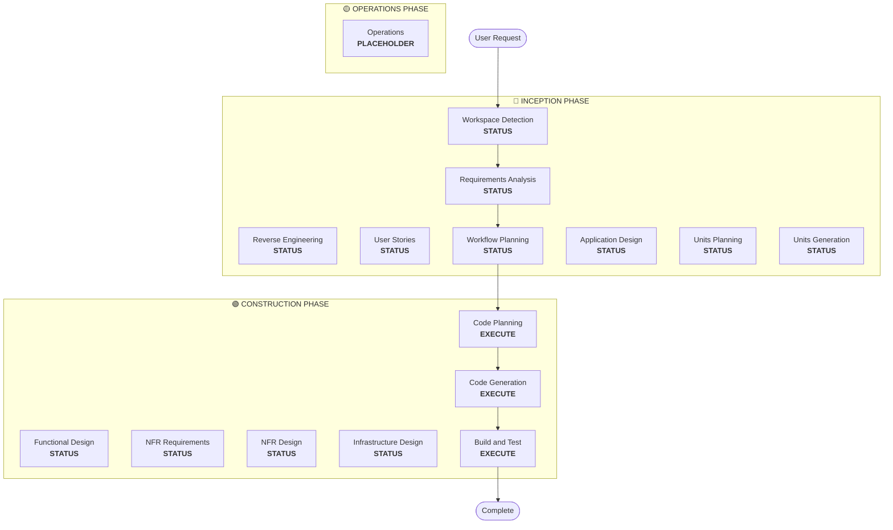

# Workflow Planning

**Purpose**: Determine which phases to execute and create comprehensive execution plan

**Always Execute**: This phase always runs after understanding requirements and scope

## Step 1: Load All Prior Context

### 1.1 Load Project-Type Extension Artifacts (if applicable)

**If a project-type extension is loaded**, read the extension's rules file to determine the output directory of its pre-requirements stage, then load the artifacts it generated there (typically architecture, inventory, technology-stack, and dependencies documents).

**Also apply the extension's Workflow Planning Addendum** (if one is defined in the extension's `## Stage Addendums` section) before proceeding with the remaining steps.

### 1.2 Load Requirements Analysis
- requirements.md (includes intent analysis)
- requirement-verification-questions.md (with answers)

### 1.3 Load User Stories (if executed)
- stories.md
- personas.md

## Step 2: Detailed Scope and Impact Analysis

**Now that we have complete context (requirements + stories), perform detailed analysis:**

### 2.1 Change Impact Assessment

#### Impact Areas
1. **User-facing changes**: Does this affect user experience?
2. **Structural changes**: Does this change system architecture?
3. **Data model changes**: Does this affect database schemas or data structures?
4. **API changes**: Does this affect interfaces or contracts?
5. **NFR impact**: Does this affect performance, security, or scalability?

#### Application Layer Impact (if applicable)
- **Code changes**: New entry points, adapters, configurations
- **Dependencies**: New libraries, framework changes
- **Configuration**: Environment variables, config files
- **Testing**: Unit tests, integration tests

#### Infrastructure Layer Impact (if applicable)
- **Deployment model**: Lambda→ECS, EC2→Fargate, etc.
- **Networking**: VPC, security groups, load balancers
- **Storage**: Persistent volumes, shared storage
- **Scaling**: Auto-scaling policies, capacity planning

#### Operations Layer Impact (if applicable)
- **Monitoring**: CloudWatch, custom metrics, dashboards
- **Logging**: Log aggregation, structured logging
- **Alerting**: Alarm configurations, notification channels
- **Deployment**: CI/CD pipeline changes, rollback strategies

### 2.2 Risk Assessment

Evaluate risk level:
1. **Low**: Isolated change, easy rollback, well-understood
2. **Medium**: Multiple components, moderate rollback, some unknowns
3. **High**: System-wide impact, complex rollback, significant unknowns
4. **Critical**: Production-critical, difficult rollback, high uncertainty

## Step 3: Phase Determination

### 3.1 User Stories - Already Executed or Skip?
**Already executed**: Move to next determination
**Not executed - Execute IF**:
- Multiple user personas
- User experience impact
- Acceptance criteria needed
- Team collaboration required

**Skip IF**:
- Internal refactoring
- Bug fix with clear reproduction
- Technical debt reduction
- Infrastructure changes

### 3.2 Application Design - Execute IF:
- New components or services needed
- Component methods and business rules need definition
- Service layer design required
- Component dependencies need clarification

**Skip IF**:
- Changes within existing component boundaries
- No new components or methods
- Pure implementation changes

### 3.3 Design (Units Planning/Generation) - Execute IF:
- New data models or schemas
- API changes or new endpoints
- Complex algorithms or business logic
- State management changes
- Multiple packages require changes
- Infrastructure-as-code updates needed

**Skip IF**:
- Simple logic changes
- UI-only changes
- Configuration updates
- Straightforward implementations

### 3.4 NFR Implementation - Execute IF:
- Performance requirements
- Security considerations
- Scalability concerns
- Monitoring/observability needed

**Skip IF**:
- Existing NFR setup sufficient
- No new NFR requirements
- Simple changes with no NFR impact

## Step 4: Note Adaptive Detail

**See [depth-levels.md](../common/depth-levels.md) for adaptive depth explanation**

For each stage that will execute:
- All defined artifacts will be created
- Detail level within artifacts adapts to problem complexity
- Model determines appropriate detail based on problem characteristics

## Step 5: Generate Workflow Visualization

Create Mermaid flowchart showing:
- All phases in sequence
- EXECUTE or SKIP decision for each conditional phase
- Proper styling for each phase state

**Styling rules** (add after flowchart):
```
style WD fill:#4CAF50,stroke:#1B5E20,stroke-width:3px,color:#fff
style CP fill:#4CAF50,stroke:#1B5E20,stroke-width:3px,color:#fff
style CG fill:#4CAF50,stroke:#1B5E20,stroke-width:3px,color:#fff
style BT fill:#4CAF50,stroke:#1B5E20,stroke-width:3px,color:#fff
style US fill:#BDBDBD,stroke:#424242,stroke-width:2px,stroke-dasharray: 5 5,color:#000
style Start fill:#CE93D8,stroke:#6A1B9A,stroke-width:3px,color:#000
style End fill:#CE93D8,stroke:#6A1B9A,stroke-width:3px,color:#000

linkStyle default stroke:#333,stroke-width:2px
```

**Style Guidelines**:
- Completed/Always execute: `fill:#4CAF50,stroke:#1B5E20,stroke-width:3px,color:#fff` (Material Green with white text)
- Conditional EXECUTE: `fill:#FFA726,stroke:#E65100,stroke-width:3px,stroke-dasharray: 5 5,color:#000` (Material Orange with black text)
- Conditional SKIP: `fill:#BDBDBD,stroke:#424242,stroke-width:2px,stroke-dasharray: 5 5,color:#000` (Material Gray with black text)
- Start/End: `fill:#CE93D8,stroke:#6A1B9A,stroke-width:3px,color:#000` (Material Purple with black text)
- Phase containers: Use lighter Material colors (INCEPTION: #BBDEFB, CONSTRUCTION: #C8E6C9, OPERATIONS: #FFF59D)

## Step 6: Create Execution Plan Document

Create `aidlc-docs/inception/plans/execution-plan.md`:

```markdown
# Execution Plan

## Detailed Analysis Summary

### Change Impact Assessment
- **User-facing changes**: [Yes/No - Description]
- **Structural changes**: [Yes/No - Description]
- **Data model changes**: [Yes/No - Description]
- **API changes**: [Yes/No - Description]
- **NFR impact**: [Yes/No - Description]

### Project-Type Extension Analysis (if applicable)
[Transformation scope, component relationships, or external resource constraints from extension addendum — omit if greenfield]

### Risk Assessment
- **Risk Level**: [Low/Medium/High/Critical]
- **Rollback Complexity**: [Easy/Moderate/Difficult]
- **Testing Complexity**: [Simple/Moderate/Complex]

## Workflow Visualization



**Note**: Replace STATUS placeholders with actual phase status (COMPLETED/SKIP/EXECUTE) and apply appropriate styling

## Phases to Execute

### 🔵 INCEPTION PHASE
- [x] Workspace Detection (COMPLETED)
- [x] Reverse Engineering (COMPLETED/SKIPPED)
- [x] Requirements Elaboration (COMPLETED)
- [x] User Stories (COMPLETED/SKIPPED)
- [x] Execution Plan (IN PROGRESS)
- [ ] Application Design - [EXECUTE/SKIP]
  - **Rationale**: [Why executing or skipping]
- [ ] Units Planning - [EXECUTE/SKIP]
  - **Rationale**: [Why executing or skipping]
- [ ] Units Generation - [EXECUTE/SKIP]
  - **Rationale**: [Why executing or skipping]

### 🟢 CONSTRUCTION PHASE
- [ ] Functional Design - [EXECUTE/SKIP]
  - **Rationale**: [Why executing or skipping]
- [ ] NFR Requirements - [EXECUTE/SKIP]
  - **Rationale**: [Why executing or skipping]
- [ ] NFR Design - [EXECUTE/SKIP]
  - **Rationale**: [Why executing or skipping]
- [ ] Infrastructure Design - [EXECUTE/SKIP]
  - **Rationale**: [Why executing or skipping]
- [ ] Code Planning - EXECUTE (ALWAYS)
  - **Rationale**: Implementation approach needed
- [ ] Code Generation - EXECUTE (ALWAYS)
  - **Rationale**: Code implementation needed
- [ ] Build and Test - EXECUTE (ALWAYS)
  - **Rationale**: Build, test, and verification needed

### 🟡 OPERATIONS PHASE
- [ ] Operations - PLACEHOLDER
  - **Rationale**: Future deployment and monitoring workflows

## Package Change Sequence (if applicable — from project-type extension addendum)
[List package update sequence with dependencies, if the active extension's Workflow Planning Addendum defines one]

## Estimated Timeline
- **Total Phases**: [Number]
- **Estimated Duration**: [Time estimate]

## Success Criteria
- **Primary Goal**: [Main objective]
- **Key Deliverables**: [List]
- **Quality Gates**: [List]

[Include extension-specific success criteria from the active extension's addendum, if any]
```

## Step 7: Initialize State Tracking

Update `aidlc-docs/aidlc-state.md`:

```markdown
# AI-DLC State Tracking

## Project Information
- **Project Type**: [Greenfield/Brownfield/Greyfield]
- **Start Date**: [ISO timestamp]
- **Current Stage**: INCEPTION - Workflow Planning

## Execution Plan Summary
- **Total Stages**: [Number]
- **Stages to Execute**: [List]
- **Stages to Skip**: [List with reasons]

## Stage Progress

### 🔵 INCEPTION PHASE
- [x] Workspace Detection
- [x] Reverse Engineering / External Resource Analysis (if applicable)
- [x] Requirements Analysis
- [x] User Stories (if applicable)
- [x] Workflow Planning
- [ ] Application Design - [EXECUTE/SKIP]
- [ ] Units Planning - [EXECUTE/SKIP]
- [ ] Units Generation - [EXECUTE/SKIP]

### 🟢 CONSTRUCTION PHASE
- [ ] Functional Design - [EXECUTE/SKIP]
- [ ] NFR Requirements - [EXECUTE/SKIP]
- [ ] NFR Design - [EXECUTE/SKIP]
- [ ] Infrastructure Design - [EXECUTE/SKIP]
- [ ] Code Planning - EXECUTE
- [ ] Code Generation - EXECUTE
- [ ] Build and Test - EXECUTE

### 🟡 OPERATIONS PHASE
- [ ] Operations - PLACEHOLDER

## Current Status
- **Lifecycle Phase**: INCEPTION
- **Current Stage**: Workflow Planning Complete
- **Next Stage**: [Next stage to execute]
- **Status**: Ready to proceed
```

## Step 8: Present Plan to User

```markdown
# 📋 Workflow Planning Complete

I've created a comprehensive execution plan based on:
- Your request: [Summary]
- Pre-requirements analysis: [Summary if a project-type extension is loaded]
- Requirements: [Summary if executed]
- User stories: [Summary if executed]

**Detailed Analysis**:
- Risk level: [Level]
- Impact: [Summary of key impacts]
- Components affected: [List]

**Recommended Execution Plan**:

I recommend executing [X] stages:

🔵 **INCEPTION PHASE:**
1. [Stage name] - *Rationale:* [Why executing]
2. [Stage name] - *Rationale:* [Why executing]
...

🟢 **CONSTRUCTION PHASE:**
3. [Stage name] - *Rationale:* [Why executing]
4. [Stage name] - *Rationale:* [Why executing]
...

I recommend skipping [Y] stages:

🔵 **INCEPTION PHASE:**
1. [Stage name] - *Rationale:* [Why skipping]
2. [Stage name] - *Rationale:* [Why skipping]
...

🟢 **CONSTRUCTION PHASE:**
3. [Stage name] - *Rationale:* [Why skipping]
4. [Stage name] - *Rationale:* [Why skipping]
...

[IF project-type extension addendum defines a package update sequence]
**Recommended Package Update Sequence**:
1. [Package] - [Reason]
2. [Package] - [Reason]
...

**Estimated Timeline**: [Duration]

> **📋 <u>**REVIEW REQUIRED:**</u>**  
> Please examine the execution plan at: `aidlc-docs/inception/plans/execution-plan.md`

> **🚀 <u>**WHAT'S NEXT?**</u>**
>
> **You may:**
>
> 🔧 **Request Changes** - Ask for modifications to the execution plan if required
> [IF any stages are skipped:]
> 📝 **Add Skipped Stages** - Choose to include stages currently marked as SKIP
> ✅ **Approve & Continue** - Approve plan and proceed to **[Next Stage Name]**
```

## Step 9: Handle User Response

- **If approved**: Proceed to next stage in execution plan
- **If changes requested**: Update execution plan and re-confirm
- **If user wants to force include/exclude stages**: Update plan accordingly

## Step 10: Log Interaction

Log in `aidlc-docs/audit.md`:

```markdown
## Workflow Planning - Approval
**Timestamp**: [ISO timestamp]
**AI Prompt**: "Ready to proceed with this plan?"
**User Response**: "[User's COMPLETE RAW response]"
**Status**: [Approved/Changes Requested]
**Context**: Workflow plan created with [X] stages to execute

---
```
